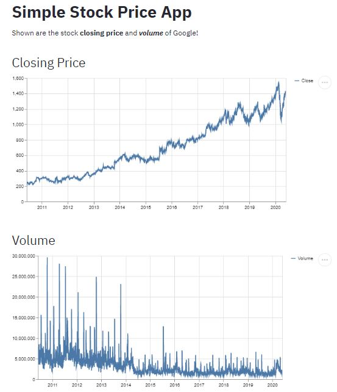

# Data Web App In Python
Build a Simple Machine Learning Web App in Python

- Follow a simple tutorial in Medium page
<a href="https://towardsdatascience.com/how-to-build-a-data-science-web-app-in-python-61d1bed65020">How to Build a Data Science Web App in Python</a>

- Preview result

